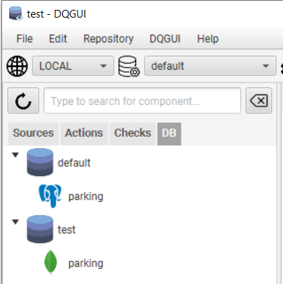
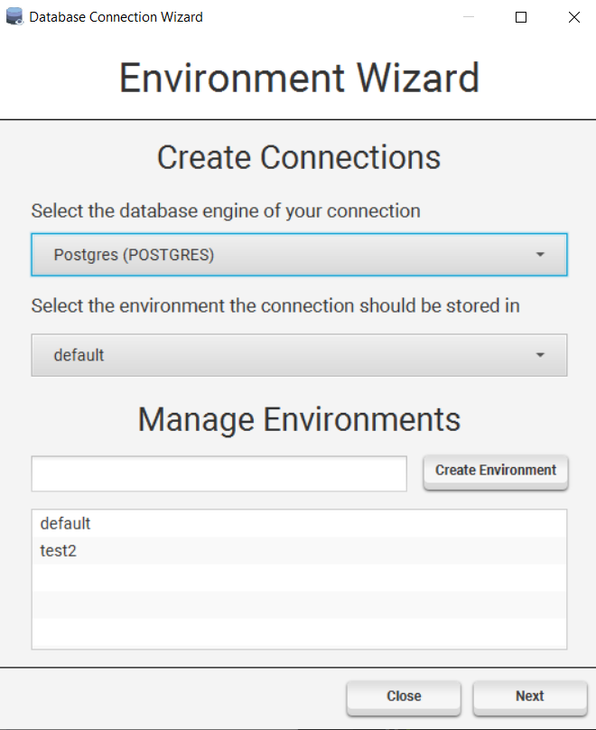
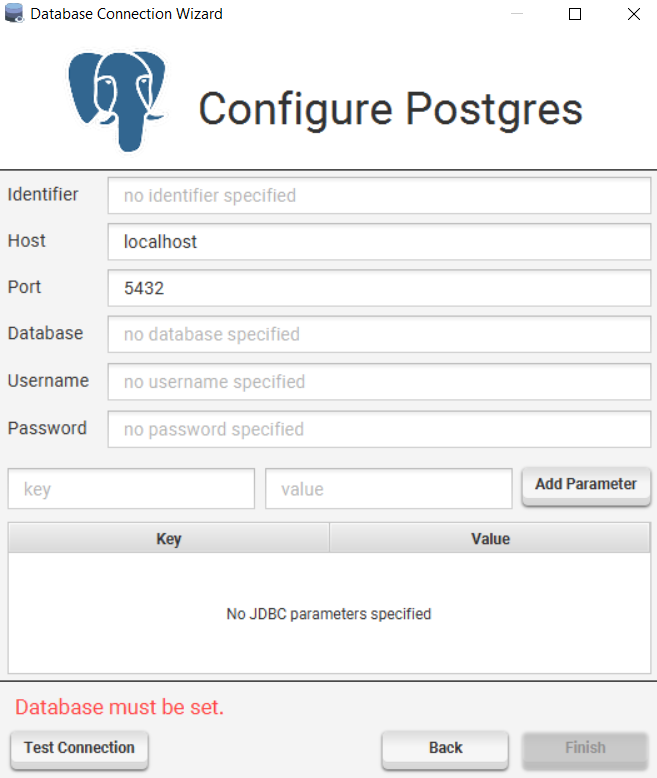

DQGUI categorizes database connections into environments. Every project has their own set of environments that contain connections.

A connection is not an actual connection in the sense of being connected to a database, but rather a set of credentials required to connect to said database.

### Environments

Environments can hold multiple connections with the same identifier, but there are some constraints.
- there can't be two environments with the same identifier
- there can't be two connections within the same environment sharing an identifier
- the default environment can't be deleted

You can select the current environment by using the combobox right to the database icon.

#### Managing Environments

You can create / delete environment by either using the context menu entries or the first page of the `DQGUI -> Database Wizard`.

Renaming an environment is possible by double clicking the environment name within the first page of ´DQGUI -> Database Wizard`, changing the name and than hitting enter.

### Managing Connections

#### Creation

To create a connection either use the `Create connection in` context menu entry of an environment or open the database wizard.

The wizard will guide you through the creation process and also allows you to test your connection.

This will not prevent you from adding invalid connections as it depends on the engine implementation if a test is provided.

#### Modification

To modify a connection use the `Edit` context menu entry.

#### Deletion

A connection can be deleted by using the `Remove` context menu entry.

#### Test

You can test a connection either via the wizard view or by using the `Test` context menu entry.

### Compare Connections and Environments

Via `DQGUI -> Database Comparison` it is possible to compare database connections and environments with each other. 

Differences will be shown in the text area.

