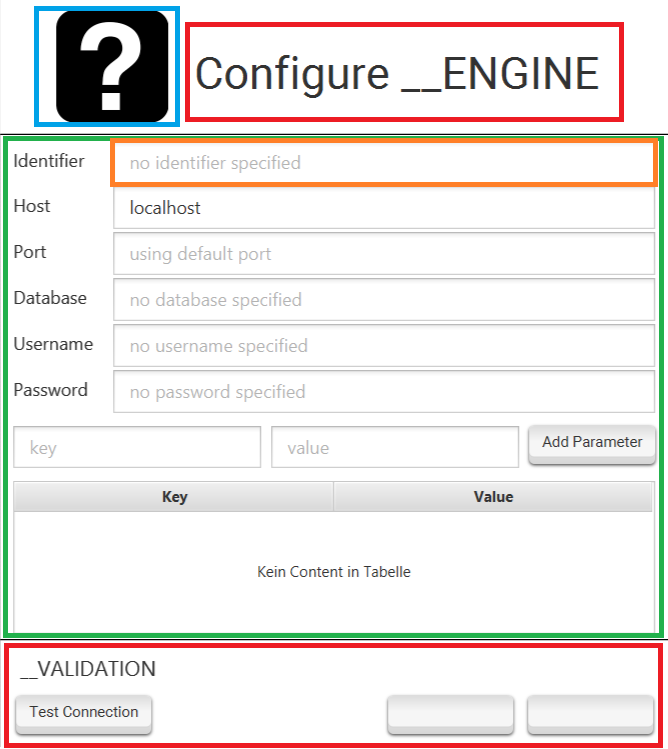
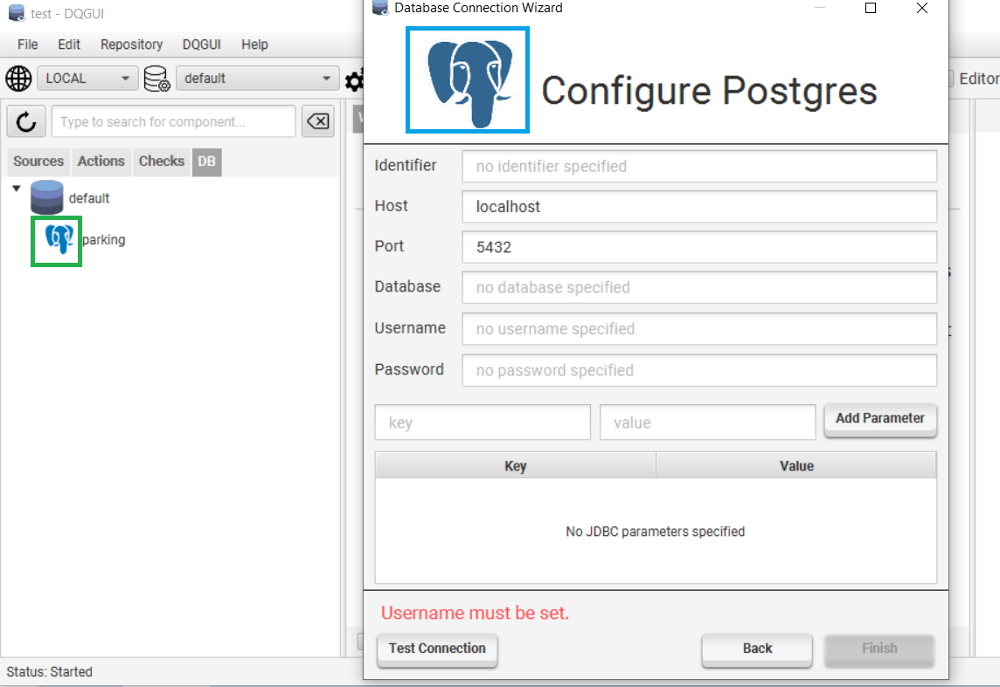
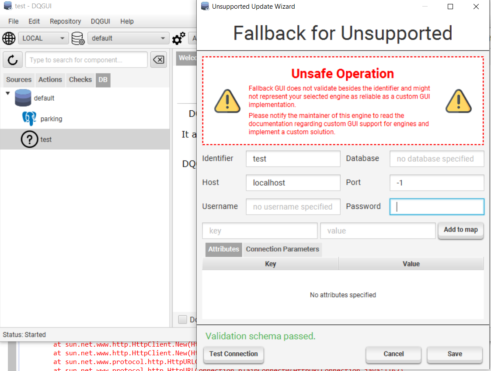

The database abstraction layer allows DQGUI to work with several different database engines. 

It is used by IQM4HD to connect to the database that are managed by DQGUI and allows developers to support previously unsupported engines by supplying their own engine implementations.

The API documentation of the mainly relevant `de.hshannover.dqgui.execution.database.api` package can be found [here](../javaDocs/de/hshannover/dqgui/execution/database/api/package-summary.html).

### Engine Manager

The EngineManager must be initialized by the using software via loading the class from the classpath via `Class.forName("de.hshannover.dqgui.execution.database.api.EngineManager");`. 

This will trigger a static initializer that scans the classpath for engine implementations to register with itself.

In case an engine fails to load or two engines share the same identifier an exception indicating the error will be thrown.

### DatabaseConnection and the Serialization Trap

In case a DatabaseConnection is serialized and deserialized on another system a [deserialization post processing hook](../javaDocs/de/hshannover/dqgui/execution/database/api/DatabaseConnection.html#engineIdentifierIsRegistered--) must be run to ensure that the backing EngineManager has an engine for the connection's identifier registered. 

A `false` return will indicated that no engine with a matching identifier has been found within the EngineManager. It is than the applications job to notify the user that the connection cannot be used as no backing engine exists on the system. 

A `true` return will internally set the backing engine within the DatabaseConnection which allows it to be used within the database abstraction layer.

A disaster would be the same identifiers on different machines backed by different engine implementations. This can't happen with `dqgui-core` and `dqgui-remote` as they both include the same database engine implementations.

### Implementing an Engine

An engine can be implemented by extending the [DatabaseEngine](../javaDocs/de/hshannover/dqgui/execution/database/api/DatabaseEngine.html) base class and placing the implementation in the `de.hshannover.dqgui.engine` package.

The engine manager will only scan `de.hshannover.dqgui.engine` and sub-packages for valid `DatabaseEngine` subclasses. If your implementation is not within this package, it will never be found and registered.

A small overview over a sample implementation is given here, it shall be noted that the tutorials give a more detailed overview and real world examples.

```java
public class SampleEngine extends DatabaseEngine {
    protected SampleEngine() throws Exception {
        // Internal initialization
        super();                        

        // REQUIRED

        // set Identifier
        // identifiers are all converted to upper case so sample, Sample and SaMplE => SAMPLE
        registerIdentifier("sample"); 
        // set language string for iqm4hd database service
        registerLanguage("sql"); 
         // gui support configuration, more later in this article
        registerGuiSupport(...);       

        // OPTIONAL

        // set default port to be displayed in the gui
        registerPort(1234);             
        // if have a repository implementation and the backing engine is relational and supports JDBC
        registerRepositorySupport(...); 
    }

    @Override
    protected void loadDatabaseDriver() throws ClassNotFoundException {
        // In case the driver need to be loaded like it is the case with some JDBC drivers
        Class.forName("org.my.driver.JDBCImpl");
    }

    @Override
    public DatabaseFetcher createFetcher(DatabaseConnection connection) {
        // JDBC supported connections can use the JdbcFetcher() implementation
        return new MyFetcher(connection);
    }

    @Override
    public String name() {
        // How the engine is treated in the UI
        return "Sample Engine";
    }

    @Override
    public boolean isRelational() { return true; }

    @Override
    public boolean allowUseForRepository() { return true; }

    @Override
    public boolean allowUseForIqm4hd() { return true; }

    @Override
    public boolean supportsJdbc() { return true; }

    @Override
    public String createDataSourceUrl(DatabaseConnection connection) {
        // https://docs.oracle.com/javase/tutorial/jdbc/basics/connecting.html
        // Only required if it is a JDBC driver
        // Otherwise null can be returned 
        return null;
    }

    @Override
    public DatabaseTestResult test(DatabaseConnection connection) {
        // If a JDBC driver exists return DatabaseTests.ofJDBC(connection); can be used
        // Otherwise you have to implement your own test
        // or redirect to reportUnsupported to let the gui know you dont support tests
        return DatabaseTests.reportUnsupported(connection);
    }

    @Override
    protected Repository<?> createRepositoryForConnection(DatabaseConnection connection) {
        // only required if you plan on supporting DQGUI repository functionality with this engine
        // for JDBC supported engines you can return JdbcRepository(connection); 
        // as long as you registered a valid repository support
        // else you need to implement it yourself 
        // or return null if you don't support a repository functionality
    }
}
```

### Adding an Engine to the DQGUI Build Process

Ideally an engine implementation should get its own sub-project. By convention engine sub-projects are named after this schema: `database-<IDENTIFIER>`.

This prevents creating engines with duplicate identifiers. The DQGUI build process automatically detects sub-projects that begin with `database-` and adds them as dependencies to the `dqgui-core` and `dqgui-remote` projects.

You can than register the new engine sub-project with the build script by adding `include 'database-<IDENTIFIER>` to the root projects `settings.gradle` file.

If we'd like to implement an engine with the identifier `postgres` we would name the sub-project `database-postgres`.

### Engine Template

A project template exists (databaseSubprojectSkeleton.zip) so you do not have to create the entire sub-project from scratch.

```
├── build.gradle
└── src
    ├── main
    │   ├── java
    │   │   └── de
    │   │       └── hshannover
    │   │           └── dqgui
    │   │               └── engine
    │   │                   ├── identifier*
    │   │                   │   └── package-info.java
    │   │                   └── identifier_hereEngine.java*
    │   └── resources
    │       └── engine
    │           └── identifier*
    └── test
        ├── java
        └── resources
```

After unpacking and renaming it correctly you will also need to rename/refactor the `*` marked files and folders above.

If our engine was named `postgres` we would end up with these changes:
- ... resources/engine/postgres => to store static assets required by the engine
- de.hshannover.dqgui.engine.PostgresEngine.java => Engine implementation
- de.hshannover.dqgui.engine.postgres => Package to store support classes 

The `build.gradle` of the sub-project has the spotbugs static analysis enabled for the main source set and will fail the build if a static analysis rule has been violated.

Spotbugs itself is not perfect and false positives happen. If you believe the spotted rule violation is not a bug but a false positive you can either set `ignoreFailures = true` or annotate the code section with the `@SuppressFBWarnings` annotation.

Areas where spotbugs frequently fails:
- everything that has to do with reflective setting of fields (will throw null value access warnings)
- JDBC ResultSet not closed while the creating Statement is closed (does not understand that closing a Statement cascades and closes everything related to the statement)

### Support Files

Support files (databaseSupportFiles.zip) exist so you do not have to create a GUI template or figure out the [YamlConfigurableRelationalRepositorySupport](../javaDocs/de/hshannover/dqgui/execution/database/api/YamlConfigurableRelationalRepositorySupport.html) configuration by yourself. More information about YamlConfigurableRelationalRepositorySupport can be found in the [Postgres tutorial](tut-pg.html#extending-yamlconfigurablerelationalrepositorysupport) which also covers how to implement database schema validation.

```
├── gui
│   ├── TEMPLATE.fxml
│   ├── fonts
│   │   └── roboto
│   │       ├── LICENSE.txt
│   │       └── Roboto-Regular.ttf
│   ├── iconList.png
│   ├── iconWizard.png
│   └── style.css
└── yamlRelationalRepoConfig
    ├── postgres_queries.yml
    └── postgres_schema.yml
```

#### What are the YAML files for?

If you only plan on implementing the engine to be used by IQM4HD you can skip this step. 

The YAML configuration files are used if you plan on supporting repositories and projects with the implemented database engine i.e. DQGUI can use this engine to store source code, projects and results in any database of this engine type. 

`YamlConfigurableRelationalRepositorySupport` only works with database engines that are:
- relational
- support JDBC

It implements [RelationalRepositorySupport](../javaDocs/de/hshannover/dqgui/execution/database/api/RelationalRepositorySupport.html) and thus allows you to use it in combination with a [JdbcRepository](../javaDocs/de/hshannover/dqgui/dbsupport/JdbcRepository.html). Using the YAML configuration is covered in the [postgres engine tutorial](tut-pg.html).

In the case that you want to add repository support for a non-relational non-JDBC supported engine [you dun goofed](https://www.urbandictionary.com/define.php?term=you%20dun%20goofed) and are forced to implement the [Repository](../javaDocs/de/hshannover/dqgui/execution/database/api/Repository.html) and [DSLService](../javaDocs/de/hshannover/dqgui/execution/DSLService.html) interfaces yourself.

Both files contain the postgres implementation and are heavily commented, if you plan to port them to another engine you would only have to change the schema (postgres schema uses json type, maybe the engine does not support it and has to use a TEXT type) and the queries (postgres queries have a ::json cast in them to work with the prepared statements, maybe your engine has a special SQL dialect).

##### Repository Validation

It is possible to validate the schema for the detected tables by implementing the [validateRepository()](../javaDocs/de/hshannover/dqgui/execution/database/api/RelationalRepositorySupport.html#validateRepository-java.util.Map-java.util.Map-java.util.Map-) method from the base class [RelationalRepositorySupport](../javaDocs/de/hshannover/dqgui/execution/database/api/RelationalRepositorySupport.html).

In case you do not want to implement a validation for the schemas, you can return null when overriding the method in your concrete class.

The validation works by comparing the metadata retrieved by the JDBC driver with a hard coded and known valid data set.

The `Map<String, Integer>` test data is generated by the [JdbcRepository](../javaDocs/de/hshannover/dqgui/dbsupport/JdbcRepository.html) via the JDBC metadata within this internal method and then passed to `validateRepository()`.

```java
    private Map<String, Integer> generateValidation(String table) throws SQLException {
        synchronized (handle) {
            try (NamedParameterStatement s = support.queryAllColumnsNoResults(table, handle)) {
                ResultSet rs = s.executeQuery();
                Map<String, Integer> validation = new HashMap<>();
                for (int i = 1; i <= rs.getMetaData().getColumnCount(); i++)
                    validation.put(rs.getMetaData().getColumnName(i), rs.getMetaData().getColumnType(i));
                return validation;
            } finally {
                handle.rollback();
            }
        }
    }
```

If you create a new engine you can retrieve the test data by printing the output of the three maps within your `validateRepository()` method and then hard code it in your concrete class. The [tut-pg.html](Postgres engine tutorial) has a reference implementation of a repository validation.

##### Auto Increment Support

The [Postgres engine tutorial](tut-pg.html) makes use of the `SERIAL` feature that postgres offers. 

Not all database engines might offer such a comfortable auto increment feature and by default `YamlConfigurableRelationalRepositorySupport` will expect an auto incrementing key.

In case of the engine not supporting any type of auto incrementing, the query configuration key:value pair `Q_PROJECT_CREATE` will allow a `:project` parameter, although you would have to override the `projectCreate()` method of the `YamlConfigurableRelationalRepositorySupport` with something that queries the database series first to retrieve an unused id and then bakes the `:project` parameter into the query.

A simple example how that could look is here. Important: we return a [KeyHandle](../javaDocs/de/hshannover/dqgui/execution/database/api/RelationalRepositorySupport.KeyHandle.html) via the static `ofSelfSupplied` factory method and include our generated key.

```java
    @Override
    @SuppressWarnings("resource")
    public KeyHandle projectCreate(String projectName, String guid, String environments, 
                                        ConnectionHandle<Connection> con) {

        String key = queryKeyFromDatabaseSeries(con);
        return KeyHandle.ofSelfSupplied(new NamedParameterStatement(con.get(), q("Q_PROJECT_CREATE"))
                .setString(ENVIRONMENTS, environments)
                .setString(PROJECT_NAME, projectName)
                .setString(GUID, guid)
                .setString(PROJECT, key), key);
    }
```

#### What are the GUI files for?

If you plan to implement a custom GUI for the database wizard this will provide a template for you.

The `TEMPLATE.fxml` file can be edited with [SceneBuilder](https://gluonhq.com/products/scene-builder/) and already has the `style.css` and `iconWizard.png` set. To change the icon you will only have to override the `iconWizard.png`.



An implementing controller must extend [AbstractEngineUpdateCreate](../javaDocs/de/hshannover/dqgui/dbsupport/gui/AbstractEngineUpdateCreate.html), you can define the implementing controller class by setting the package path + class within the  `fx:controller=""` section of the FXML file.

- <span style="color: #DE222A">Off limits. Do not edit these section! They are hooked by the AbstractEngineUpdateCreate base class.</span>
- <span style="color: #3599E4">Modified by either overriding iconWizard.png or changing the icon via SceneBuilder.</span>
- <span style="color: #3BA844">Can be modified freely as long as...</span>
- <span style="color: #f4772e">... a TextField with the fxml:id 'identifier' exists. This TextField is also hooked by AbstractEngineUpdateCreate.</span>

### GUI Configurations

GUI Configurations declare how the engine should integrate with DQGUIs user interfaces.

A GUI configuration can be created by accessing one of the static factory methods in [GuiConfiguration](../javaDocs/de/hshannover/dqgui/execution/database/gui/GuiConfiguration.html) class.



- <span style="color: #3599E4">What is referred to as `wizardIcon`. Only relevant for the JDBCCommon configuration. If not set a placeholder will take its place.</span>
- <span style="color: #3BA844">Referred to as `listIcon`. Relevant for every engine. If not set a placeholder will take its place.</span>

`ofCustom()`
- allows to create a custom GUI configuration that is loaded when the engine is edited by the wizard.
- Provides a `listIcon` and custom FXML + CSS for the FXML

`ofJDBCCommon()`
- JDBCCommon shall be used for common JDBC engine i.e. they require a host/port/database/username/password.
- Will also provide a input mask for additional connection parameters
- Calling this with the two icon parameter will set the `wizardIcon` and `listIcon`

`ofFallback()`
- If your engine is not a JDBCCommon and you do not have a custom GUI integration ready. This will set the `listIcon` to a placeholder and load an unsafe fallback wizard that does not validate its input.
- Not recommended but allows the engine to be configured without creating a GUI implementation



As seen in the screenshot, the port is set to -1 and the validation scheme still passes. The placeholder icon can also be seen on the left side.

The [MongoDB tutorial](tut-mongo.html) covers a custom GUI implementation.