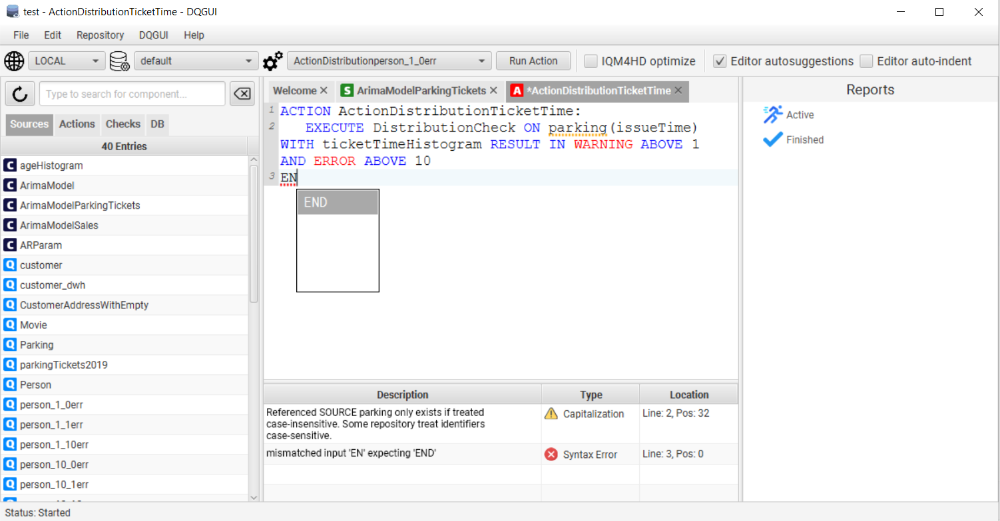
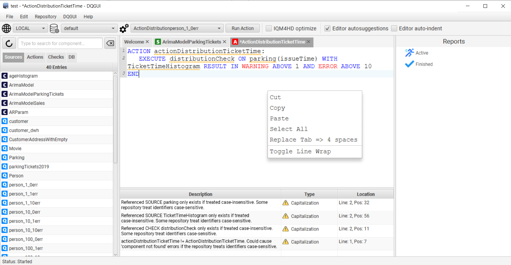
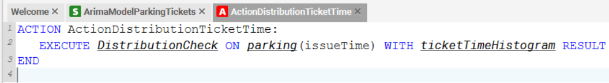

The editor allows basic editing of source files and helps with syntax highlighting, a simple static analysis and autocomplete.

### Autocomplete

Autocomplete can be enabled and disabled via the `Editor autosuggestions` checkbox in the main window. 

| Shortcut   | Description  |
| ------------- |:-------------:|
|CTRL + SPACE | Open autocomplete (if selected & available)|
|ESCAPE| Close autocomplete|
|DOWN / UP | Select item up / down|
|ENTER| Commit selected item|

### Syntax Highlighting and Static Analysis

Asynchronous syntax highlighting and static analysis ensure smooth operation while typing.

The static analysis helps with marking database identifiers that do not exist in any currently loaded environment, marking missing dependencies or warning if the identifier and component name do not match.

### Other Features

A tab is always converted to 4 spaces.

- `Editor auto-indent` keeps the indentation level when entering a new line with enter
- `Context -> Toggle Line Wrap` allows to wrap lines so the entire content can be displayed at once
- `Context -> Replace Tab <=> 4 spaces` allows to replace all tabs with hard spaces, JavaFX has the tab behavior hard coded to 8 spaces and it is not possible to change that behavior with the current JavaFX version.

Pressing CTRL while having a source file open will highlight referenced dependencies.

If present, clicking on such a reference will open the corresponding file otherwise a creation wizard is started.

### Shortcuts

These are custom implemented shortcuts, the editor features a whole lot of other commonly know shortcuts that were already implemented by the RichtTextFX base class.

| Shortcut   | Description  |
| ------------- |:-------------:|
|CTRL + S | Save current tab|
|CTRL + SHIFT + S | Save all|
|CTRL + W | Close current tab|
|CTRL + SHIFT + W | Close all tabs|
|CTRL + Z | Undo |
|CTRL + Y | Redo |
|F1| Select next left tab|
|F2| Select next right tab|
|F3| Move selected tab left|
|F4| Move selected tab right |
|CTRL | Show referenced source files |