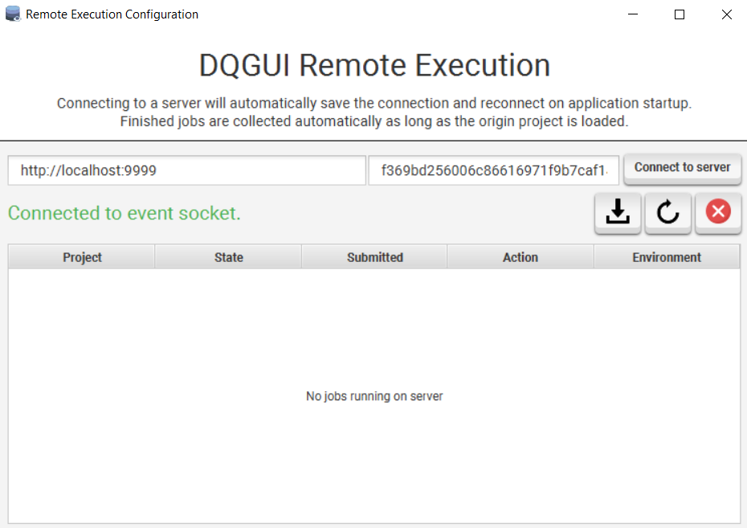
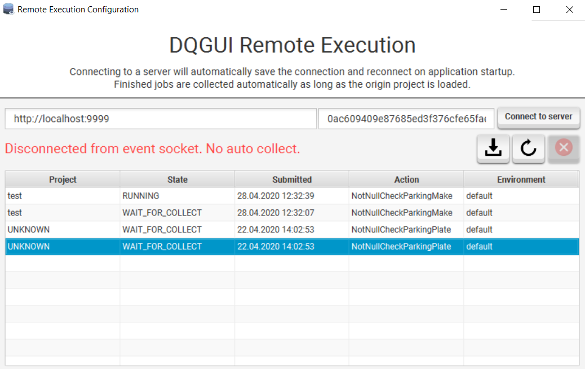
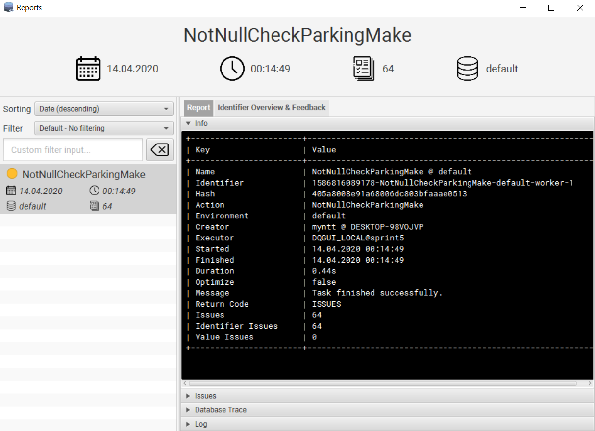
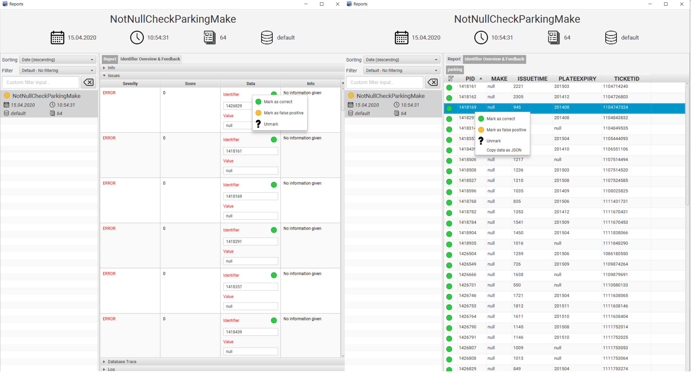
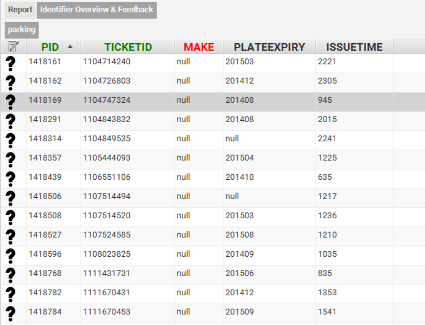

### Running an Action

To run an Action you can either select it from the third combobox with the gear symbol in the main view or select it by right clicking on an Action and using the `Select as action` context menu entry.

To run the action locally be sure to have `LOCAL` selected in the first combobox.

#### Remote Execution

You can configure a remote execution server by opening the Remote Execution Configuration via `DQGUI -> DQGUI Remote`.

To add a server fill out the host and key fields and hit connect. If the connection succeeded a notification will be shown in the top right corner and the status will changed to connect to event socket.

As long as you're connected to the event socket you can be 101% sure that remote execution will work, DQGUI will also automatically collect the finished results from the server and notify you about them.

If the text status says `Disconnected from event socket. No auto collect.` that means that the server might be down or might be running. Finished jobs would not be automatically collected.

Once you connected to a server DQGUI will attempt to automatically connect on every startup. A notification will inform if the attempt succeeded or failed.

Should the event socket loose connection you will also receive a notification.

Currently running or uncollected jobs are listed in the table. They're automatically refreshed if either the socket receives a notification or a job has been sent to the server.

Via the context menu you can view the current log of the job (only if it is still running).

- the download icon will collect all jobs that match the currently loaded project
- the refresh icon will refresh the job list
- the `X` will disconnect form the event socket
- you can reconnect by clicking `Connect to server`

You can than run a remote job by changing the value of the first combobox in the main view to `REMOTE`.

Jobs that have not been collected yet will display the `WAIT_FOR_COLLECT` state. 

Collecting jobs by hand is possible via the download button. Only jobs that belong to the loaded project will be collected. 

If DQGUI cannot determine the project `UNKNOWN` will be displayed as origin.

### Live Logging

The log of a currently running local job can be accessed by double clicking on the job within the `Active` category of the `Reports` view in the main window.

### Managing Reports

To clear reports that failed to complete due to an exception you can right click on the `Finished` category of the `Reports` view and initiate a pruning of failed tasks via the context menu.

#### Viewing

Reports can be viewed via the `DQGUI -> Explore Reports` view.

Only reports that have successfully completed are being displayed here. It is possible to search and filter them.

#### Removal

The report listing supports multi-selection. To remove one or more reports simply select them and delete them by either the delete key or via the right click context menu. 

#### Feedback

| Icon   | Meaning  |
| ------------- |:-------------:|
||No feedback evaluated yet|
||Identifier marked as false positive|
||Identifier marked as correctly evaluated|

Feedback can be viewed and edited either via the `Issues` section in the `Report` tab or via the `Identifier Overview & Feedback` tab.

The `Identifier Overview & Feedback` lists all data mapped by the identifier.

Within the `Report` tab it is possible to change the feedback status by using the right-click context menu within any row of the `Data` column.

The `Identifier Overview & Feedback` allows to change feedback status via the right-click context menu by clicking on any row entry.

It is also possible to copy the `Identifer` and `Value` entries by using the right-click context menu on their respective fields.

Within the `Identifier Overview & Feedback` a `Copy data as JSON` context menu item allows to copy the entire row as JSON formatted string.

The column names that match those of the `IDENTIFIER` in the `Identifier Overview & Feedback` will be colored green and placed the left most after the feedback status column (not visible in the screenshot, as from an older version).

`value` roles from the action are also parsed and the corresponding column names are marked red.

