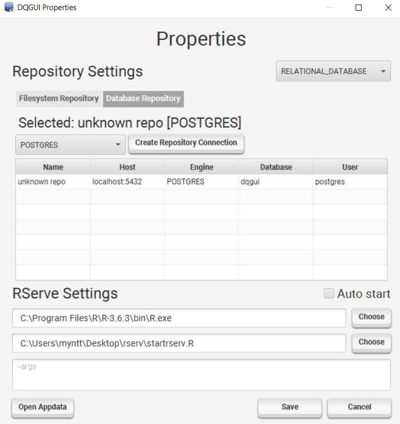
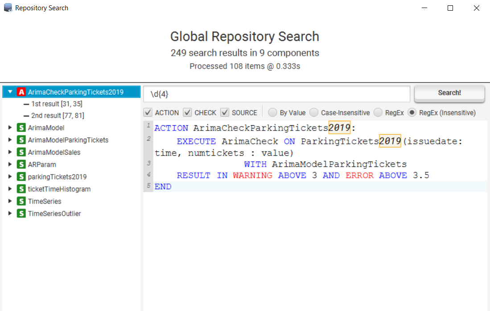
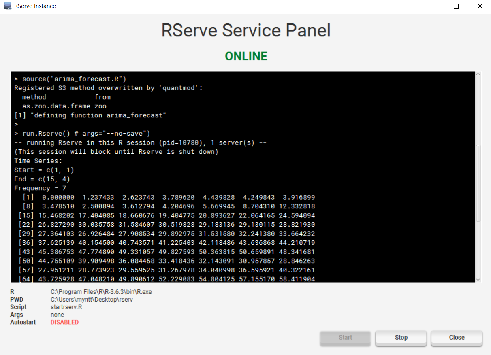
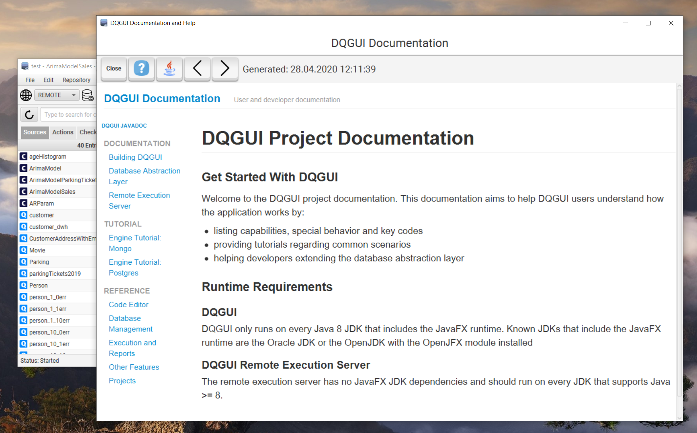

All windows besides the main window can be closed / canceled by using the `ESC` key, most input masks react on `ENTER` as accept, those who do not were probably just forgotten.

### Component Management

Components can either be opened by double clicking them, pressing space while navigating within the table or via the context menu.

#### Creation

A component can be created via `File -> New -> [ACTION | SOURCE | CHECK]`.

It is possible to change the component type while still being in creation menu.

The components name is validated to prevent duplicates. If the created component is a check, it will be created as local check.

#### Renaming

A component can be renamed by using the `Rename` context menu entry.

It is not possible to give a component an already existing identifier.

#### Deletion

Multi-selection is supported. 

A deletion can be triggered by either triggered by pressing the `DEL` key or using the `Remove` context menu entry.

#### Promotion / Demotion

Checks can be promoted / demoted to / from global.

A global check is stored project wide and can be accessed from multiple projects.

More about global checks in the [projects section.](projects.html).

### Component Icons

| Icon   | Meaning  |
| ------------- |:-------------:|
||Component is an Action|
||Component is a local check|
||Component is a global check|
||Component is a Source|
||Component is a query Source|
||Component is a const Source|

### Properties

When you save the properties the currently selected repository type is set as default. 

#### Filesystem Repository
- Configure the global check location (default is in appdata)

#### Database Repository
- Manage database repositories
- Create / Delete / Modify / Select possible by either using the create button or the context menu

A database repository will always automatically connect on application startup.

#### RServe Settings
- set path of R executable
- set path of RServe start script
- pass extra args if required
- auto start allows you to start R automatically on startup

You can also access the DQGUI appdata via the `Open Appdata` button.

### Repository Reload

Will reload the entire project and repository.

### Repository Search

The search allows you to search through all global / local components that exist within the repository.
- You can select if you want to exclude ACTION / CHECK / SOURCE components

The following search options exist:
- `By Value`: Will search exactly for the string inputted
- `Case-Insensitive`: Will search for the string inputted, but case-insensitive
- `RegEx`: Will allow you to use [Java regular expression constructs](https://docs.oracle.com/javase/8/docs/api/java/util/regex/Pattern.html)
- `RegEx`: Same as above but with a case-insensitive flag

Clicking on one of the marked results will open the file in the editor, put your cursor at the search hit position and draw a red box around the result.

Note: This only works if the file was not changed since the search finished.

### Import

Allows you to import components from the file system into your project.
- all files ending with `.iqm4hd` inside your import directory are processed
- files are categorized by whether they start with ACTION / SOURCE / CHECK
- files that don't start with such a keyword are ignored and outputted as warning
- all checks are imported as local checks
- if a component already exist within the project it will *NOT* be overwritten

Ticking the `Force Overwrite` box will overwrite existing components.
- If the component is a global check it will not be overwritten
- It is impossible to overwrite global checks via import

# Export

Allows to export components from your project into a folder in the filesystem.

### RServe Management

The RServ Service Panel allows you to start / stop an RServe instance and also shows the std::out / std::err of the R process.

If you stop the application gracefully without stopping R explicitly a shutdown hook will kill R.

Do something like `kill -9` and you've created yourself an R orphan.

### Documentation

This documentation and the javadocs can also be found via `Help -> Help and Documentation`.

### Licensing / About

Shows licenses, libraries used and the creators of DQGUI.