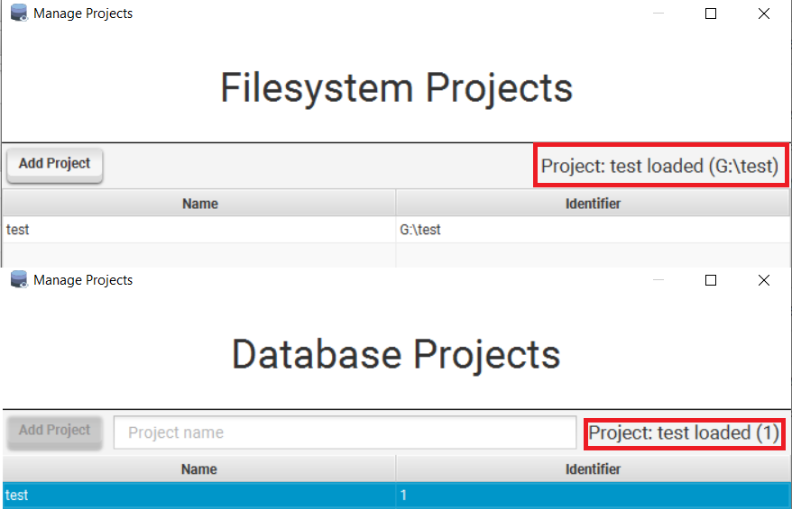

Projects allow separation of components, environments and execution results.

There are currently two project implementations that are listed below.

### File System Projects

A project on the filesystem. Global checks are loaded through a globally defined directory.

The file structure of a file system project looks like this:

```
.
├── actions
│   ├── ARIMACheck.iqm4hd
|   |...
├── checks
│   ├── ARCheck.iqm4hd
|   ...
├── environments.json
├── fs-extra.json
├── guid
├── results
│   ├── feedbacks
│   │   └── 1586811209086-NotNullCheckParkingPlate-default-worker-1-feedback.json
│   ├── finished-workers.json
│   ├── logs
│   │   └── 1586811209086-NotNullCheckParkingPlate-default-worker-1.log
│   └── reports
│       └── 1586811209086-NotNullCheckParkingPlate-default-worker-1-report.json
└── sources
    ├── ARParam.iqm4hd
    ...
```

### Database Projects

A project within a database. 

In this context a database is referred to as a repository as it can hold multiple projects.

Global checks are accessible by all projects in the database while the other components are separated from each other.

#### Multi-user State Visibility Issues

Per specification it was decided that it rarely happens that multiple users would work on a project concurrently, together with the requirement to directly operate on the database it is thus not possible to notify other clients connected to the repository of state changes.

This introduces three problems that users of DQGUI should be aware of when working on one project concurrently:

**Database Environment updates are not propagated to other clients that have the same project loaded**
  - Client A and B have the same initial database environments
  - Client A adds connection `test` to the default environment
  - The database entry is updated
  - Client B decides to also add a `test` connection to the default environment, but this connection uses a different server than the connection that client A added
  - Normally client B would get an error that `test` already exists within the environment
  - But because A and B work on the project concurrently, and thus started with the same state, the state changes that client A made were not propagated to client B
  - Client B thus operates on old data and overrides the environments, and thus client A's version of `test` with their `test` connection

**Feedback updates are also not propagated to other clients that have the report opened**
  - two users updating the same report's feedback concurrently will overwrite each other without seeing the other users updates
  - reports and feedback are cached once loaded, closing and opening the `Reports` window will always guarantee a the newest feedback state

**Deleting a component can cause issues for users currently editing and then saving it**
  - User A and B have the same project loaded
  - User A works on the `testCheck` check, has it loaded in a tab and is currently typing
  - User B deletes the `testCheck` check from the project
  - User A saves their work
  - An exception will be thrown now, as user A tries to save something that does not exist anymore

**Changes to reports are not propagated to other clients**
  - Deleting a report will not inform the other clients about the deletion until they restart
  - A deleted report can still be accessed because all reports are cached
  - On application startup a removal of invalid reports is automatically initiated
  - Same goes for newly added reports, refreshing the repository helps without restarting the application

These issues are however not deemed as too important, as they would rarely occur. 

Most database environment operations are write once, read many. It is likely that once a project is created, all environments and connections will be set-up by one user and that those will rarely change.

Feedback is most likely being evaluated after a report finishes by the user that launched the report.

The third scenario is unlikely as well, as it does not often happen that a check is deleted while someone else is working on it.

Every repository implementation is free to decide how the underlying database transactions are handled. The `JdbcRepository` has auto-commit turned off and calls a **rollback** on all `select` queries and a **commit** on all successful `insert` or `update` queries (failed onces are reverted with **rollback**). There are thus no locks kept open after dealing with a resource and all above mentioned problems can occur.

In case this should ever be fixed, a potential solution would be to create a repository server that uses an underlying SQLite database for the repository, clients can than connect to a websocket that notifies of any changes.

Change operations would be put in a queue that executes on operation at a time and guarantees that all clients would receive valid state updates.

### Management

A project can be created by using the `Repository -> Manage Projects` entry.
- adding a file system project will open up a directory chooser
- adding a database project will require a project name to be set
- multiple database projects can share the same name as the identifier is used as primary key



- Once added a project can be deleted or selected via the context menu.
- Double clicking a project will also select it, only a selected project is loaded.
- To check if your project is loaded ensure that the top right label contains the project.
- Deleting a project can never delete the global checks.

Filesystem projects can also be removed, that means it disappears from the list but continues to exist on the filesystem.