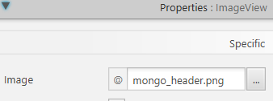
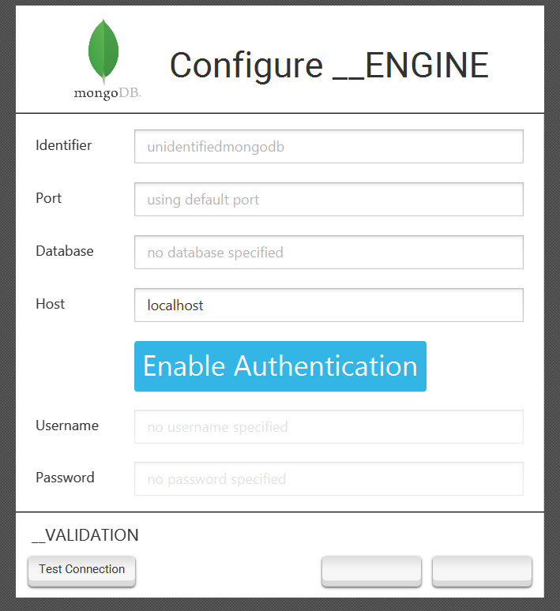
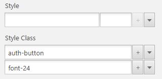
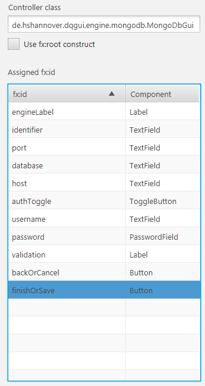

**It is required that the article on the [Database Abstraction Layer](dba.html) has been read thoroughly in order to be able to follow this tutorial.**

This tutorial will show how MongoDB support is implemented via the Database Abstraction Layer.

### Preconditions

- MongoDB is not relational
- MongoDBs official driver is used, it provides no JDBC support
- We don't want to offer repository support, only IQM4HD support

### Workload
- No [Fetcher](../javaDocs/de/hshannover/dqgui/execution/database/api/DatabaseFetcher.html) exists, thus we need to implement our own.
- We will use the [ofCustom() GuiConfiguration](../javaDocs/de/hshannover/dqgui/execution/database/gui/GuiConfiguration.html) and supply our own GUI.
- No database test exist so we will have to create our own.

### Integrating with Build Script

We start by unzipping the sub-project skeleton, registering it with the build script and changing all placeholder identifiers to `mongo` and adding the MongoDB driver to our sub-project.

```gradle
// https://mvnrepository.com/artifact/org.mongodb/mongo-java-driver
implementation group: 'org.mongodb', name: 'mongo-java-driver', version: '3.12.2'
```

### Setting up resources

We copy the FXML, css and fonts folder from the database support zip GUI folder into `engine/mongo` resource folder.

We also search the internet for icons that shall be displayed in the wizard and menu and place them in the `engine/mongo` folder as well with the following names:
- wizard icon: `mongo_header.png`
- list icon: `MONGO.png`

Our resource folder looks like this now:

```
.
├── main
│   └── resources
│       └── engine
│           └── mongo
│               ├── MONGO.fxml
│               ├── MONGO.png
│               ├── fonts
│               │   └── roboto
│               │       ├── LICENSE.txt
│               │       └── Roboto-Regular.ttf
│               ├── mongo_header.png
│               └── style.css
```

### Extending DatabaseFetcher

We implement our own fetcher by extending [DatabaseFetcher](../javaDocs/de/hshannover/dqgui/execution/database/api/DatabaseFetcher.html).

The actual fetch implementation is copied from the iqm4hd-single implementation and it returns the already implemented DocumentSetIterator that resides in the iqm4hd-single client package.

A fetchers job is to establish a connection, execute queries that return a DatabaseEntryIterator and provide a way to close a connection so no resource leaks can occur.

```java
public final class MongoDbFetcher extends DatabaseFetcher {
    private MongoClient client;

    public MongoDbFetcher(DatabaseConnection connection) {
        super(connection);
    }

    @Override
    public void initiate() {
        String host = connectionData.getSocket().getFormat() == HostFormat.IPv6 
                    ? String.format("[%s]", connectionData.getSocket().getHost()) 
                    : connectionData.getSocket().getHost();

        if(connectionData.getCredential().getUsername() == null 
            && connectionData.getCredential().getPassword() == null) {
            client = new MongoClient(new ServerAddress(host, connectionData.getSocket().getPort()), 
                MongoClientOptions.builder().serverSelectionTimeout(10000).build());
        } else {
            MongoCredential credential = MongoCredential.createCredential(
                connectionData.getCredential().getUsername(), 
                connectionData.getCredential().getDatabase(), 
                connectionData.getCredential().getPassword().toCharArray());

            client = new MongoClient(new ServerAddress(host, connectionData.getSocket().getPort()), 
                credential, 
                MongoClientOptions.builder().serverSelectionTimeout(10000).build());
        }
    }

    @Override
    public DatabaseEntryIterator fetch(String query) {
        int firstDot = query.indexOf('.');
        int secondDot = query.indexOf('.', firstDot+1);
        int open = query.indexOf('(');
        int close = query.lastIndexOf(')');
        String collection = query.substring(firstDot+1, secondDot);
        String command = query.substring(secondDot+1, open);
        String innerQuery = query.substring(open+1, close);

        MongoDatabase db = client.getDatabase(connectionData.getCredential().getDatabase());
        MongoCollection<Document> coll = db.getCollection(collection);
        MongoIterable<Document> res;

        if (command.equals("find")) {
            Document queryDoc = Document.parse(innerQuery);
            res = coll.find(queryDoc);
        } else {
            innerQuery = "{ val: " + innerQuery + "}";
            Document queryDoc = Document.parse(innerQuery);
            @SuppressWarnings("unchecked")
            List<Document> pipeline = (List<Document>) queryDoc.get("val");
            res = coll.aggregate(pipeline);
        }

        return new DocumentSetIterator(res);
    }

    @Override
    public void close() throws Exception {
        client.close();
    }
}
```

### Extending DatabaseEngine

Now we can implement our [DatabaseEngine](../javaDocs/de/hshannover/dqgui/execution/database/api/DatabaseEngine.html) subclass in the `de.hshannover.dqgui.engine` package.

```java
package de.hshannover.dqgui.engine;

public class MongoEngine extends DatabaseEngine {
    // Define resource location to resolve resources
    private static final String RESOURCES = "/engine/mongo/";
    
    protected MongoEngine() throws Exception {
        super();
    // set identifer after convention
        registerIdentifier("mongo");
    // register language for iqm4hd 
        registerLanguage("mongo");
    // default port for the gui wizard
        registerPort(27017);

    // register our custom GUI support
        registerGuiSupport(
            GuiConfiguration.ofCustom(
            // List icon
                Icon.of(MongoEngine.class.getResourceAsStream(RESOURCES + "MONGO.png")), 
            // GUI FXML
                RESOURCES + "MONGO.fxml",
            // GUI CSS
                RESOURCES + "style.css"));
    }

    @Override
    protected void loadDatabaseDriver() throws ClassNotFoundException {
        // nothing to load here
    }
    
    @Override
    public DatabaseFetcher createFetcher(DatabaseConnection connection) {
    //return our created fetcher
        return new MongoDbFetcher(connection);
    }
    
    @Override
    public String name() {
        return "MongoDB";
    }
    
    @Override
    public boolean isRelational() {
        return false;
    }
    
    @Override
    public boolean allowUseForRepository() {
        return false;
    }
    
    @Override
    public boolean allowUseForIqm4hd() {
        return true;
    }
    
    @Override
    public boolean supportsJdbc() {
        return false;
    }
    
    @Override
    public String createDataSourceUrl(DatabaseConnection connection) {
    // since it is no jdbc backed engine we dont need for format a datasource url
        return null;
    }

    @Override
    @SuppressWarnings("rawtypes")
    @SuppressFBWarnings("RV_RETURN_VALUE_IGNORED_NO_SIDE_EFFECT")
    public DatabaseTestResult test(DatabaseConnection connection) {
        // own test implementation

        String host = connection.getSocket().getFormat() == HostFormat.IPv6 
                ? String.format("[%s]", connection.getSocket().getHost()) 
                : connection.getSocket().getHost();

        if(connection.getCredential().getUsername() == null 
            && connection.getCredential().getPassword() == null) {
            try(MongoClient m = 
                    new MongoClient(new ServerAddress(host, connection.getSocket().getPort()), 
                                    MongoClientOptions.builder().serverSelectionTimeout(500).build())) {

                MongoDatabase database = m.getDatabase("admin");
                Document serverStatus = database.runCommand(new Document("serverStatus", 1));
                Map connections = (Map) serverStatus.get("connections");
                connections.get("current");
                return new DatabaseTestResult();
            } catch(Exception e) {
                return new DatabaseTestResult(e);
            }
        } else {
            MongoCredential credential = MongoCredential.createCredential(
                connection.getCredential().getUsername(), 
                connection.getCredential().getDatabase(), 
                connection.getCredential().getPassword().toCharArray());

            try(MongoClient m = 
                new MongoClient(new ServerAddress(host, connection.getSocket().getPort()), 
                                credential, 
                                MongoClientOptions.builder().serverSelectionTimeout(500).build())) {

                MongoDatabase database = m.getDatabase("admin");
                Document serverStatus = database.runCommand(new Document("serverStatus", 1));
                Map connections = (Map) serverStatus.get("connections");
                connections.get("current");
                return new DatabaseTestResult();
            } catch(Exception e) {
                return new DatabaseTestResult(e);
            }
        }
    }

    @Override
    protected Repository<?> createRepositoryForConnection(DatabaseConnection connection) {
    // no repository support so no repository to create
        return null;
    }
}

```

### Implementing the GUI Support

#### The FXML Part

We rename our TEMPLATE.fxml file to MONGO.fxml and edit it.

Setting the correct image within the header ImageView.





Styling the authentication button to our liking.

```css
.auth-button {
    -fx-border-style: none;
    -fx-border-radius: 5;
    -fx-text-fill: white;
}

.auth-button:hover {
    -fx-scale-y: 1.05;
    -fx-scale-x: 1.05;
}

#auth-disable {
    -fx-background-color: #ff4444;
}

#auth-enable {
    -fx-background-color: #33b5e5;
}
```

And setting the correct css classes on it.



Also making sure all relevant field have fx:id's set that allows JavaFX to inject them into the controller and ensuring we have our controller class set.



#### The Java Part

We create a custom controller by extending [AbstractEngineUpdateCreate](../javaDocs/de/hshannover/dqgui/dbsupport/gui/AbstractEngineUpdateCreate.html) and annotate all JavaFX components that should be injected.

The field name must be equal to the fx:id entry.

We can than implement our custom GUI controller with validation that will be hooked by all database related wizards.

```java
package de.hshannover.dqgui.engine.mongodb;

public final class MongoDbGui extends AbstractEngineUpdateCreate {
    @FXML
    TextField host, port, database, username, key, value;
    @FXML
    PasswordField password;
    @FXML
    Button backOrCancel, finishOrSave;
    @FXML
    ToggleButton authToggle;
    
// A listener that changes if the toggle triggers
// We disable/enable & clear the user fields depending on the state
// We also change the css id to signalize that the authentication mode changed
// To trigger the reevaluation of the password/user validators we also set user in case auth
// has been enabled
    private final ChangeListener<Boolean> authListener = (obs, o, n) -> {
        authToggle.setId(n ? "auth-disable" : "auth-enable");
        password.setDisable(!n);
        username.setDisable(!n);
        if(!n) {
            password.clear();
            username.clear();
        } else {
            password.setText("user");
        }
    };

    @Override
    protected void onInitialize() {
        // Register validators with super class
        // A createEmptyValidator ensures a javafx control is not empty or null
        // A predicateValidator causes the error message to be propagated if the predicate returns false

        getValidationSupport()
            .registerValidator(database, Validator.createEmptyValidator("Database must be set."));
        getValidationSupport()
            .registerValidator(host, Validator.createEmptyValidator("Host must be set."));

        // verifyPort is a method the super class provides for us
        getValidationSupport()
            .registerValidator(port, 
                Validator.createPredicateValidator(p -> verifyPort(port.getText()), 
                    "Port must be int 0 <= port <= 65535."));
        getValidationSupport()
            .registerValidator(username, 
                Validator.createPredicateValidator(p -> verifyUsernameAndPassword(), 
                    "Username/Password must be set."));
        getValidationSupport()
            .registerValidator(password, 
                Validator.createPredicateValidator(p -> verifyUsernameAndPassword(), 
                    "Username/Password must be set."));
        
        // register a wizard close hook that unregisters the listener again
        // we are using a strongly referenced listener, not removing it could cause memory leaks
        // as it would never be collected by the GC
        registerWizardCloseHook(() -> authToggle.selectedProperty().removeListener(authListener));

        // add toggle listener
        authToggle.selectedProperty().addListener(authListener);
    }
    
    private boolean verifyUsernameAndPassword() {
        if(!authToggle.isSelected()) return true;
        return username.getText() != null 
                && !username.getText().trim().isEmpty()
                && password.getText() != null 
                && !password.getText().trim().isEmpty();
    }

    @Override
    protected void onUpdate() {
        // the onUpdate call signals us that the user wants to update the connection
        // thus we can fill the fields with the values of the connection the user
        // wants to update

        boolean isProtected = oldConnection().getCredential().getPassword() != null 
            && oldConnection().getCredential().getUsername() != null;
        
        authToggle.setSelected(isProtected);

        if(isProtected) {
            password.setText(oldConnection().getCredential().getPassword());
            username.setText(oldConnection().getCredential().getUsername());
        }

        port.setText(Integer.toString(oldConnection().getSocket().getPort()));
        host.setText(oldConnection().getSocket().getHost());
        database.setText(oldConnection().getCredential().getDatabase());
    }

    @Override
    protected void onCreation() {
        // the onCreation call signals us that the user is creating a new connection
        // we thus set the toggle to disable and unpack the optional port

        port.setText(engine().defaultPort().map(s -> Integer.toString(s)).orElse(""));
        authToggle.setSelected(false);
    }

    @Override
    protected DatabaseConnection retrieveResult() {
        // the retrive hook only requires us to create the connection object

        Map<String, String> dummy = Collections.emptyMap();
        DatabaseSocket s = new DatabaseSocket(host.getText(), Integer.parseInt(port.getText()));
        DatabaseCredential c = new DatabaseCredential(
            authToggle.isSelected() ? username.getText() : null, 
            authToggle.isSelected() ? password.getText() : null, 
            database.getText());

        return DatabaseConnection.from(getIdentifier(),  engine(),  s, c, dummy, dummy);
    }
}

```

### Result

After implementing all of this we should have a working MongoDB engine implementation with IQM4HD and custom GUI support.